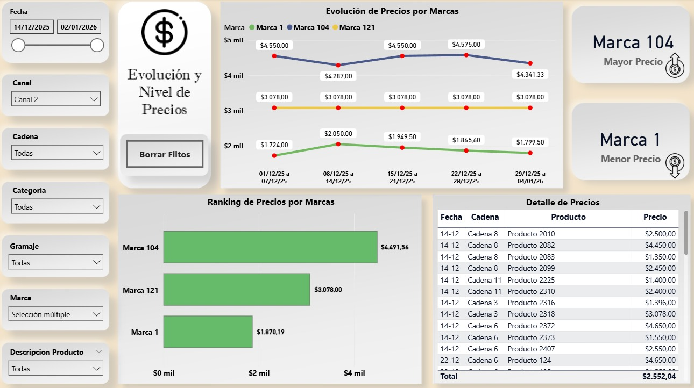

# 📊 Dashboard de Análisis de Precios – Consumo Masivo

Dashboard desarrollado en **Power BI** para el análisis de precios y posicionamiento de marcas en consumo masivo, basado en una problemática real de negocio y adaptado para fines de portfolio.

---

## 🎯 Objetivo
Analizar la evolución de precios, el nivel relativo entre marcas y la alineación entre precios observados y precios sugeridos, facilitando la toma de decisiones comerciales.

---

## 📄 Contenido del dashboard
- Evolución semanal de precios por marca  
- Ranking de marcas por nivel de precio  
- Identificación del producto más caro y más barato  
- Tabla detalle por producto y cadena
- Comparativo entre precio observado y precio sugerido con clasificación de desvíos  

---

## 📈 KPIs principales
- Precio promedio  
- Variación porcentual  
- Ranking de precios por marca  
- Diferencia % vs precio sugerido  
- Estado de alineación de precios  

---

## 🧩 Fuente de datos
Dataset en formato tabular (**Excel**) diseñado para replicar un escenario real de análisis de precios, conectado a Power BI.

---

## 🔄 Transformaciones y métricas
- Preparación y limpieza de datos en **Power Query**  
- Medidas y reglas de negocio desarrolladas en **DAX**

---

## 🛠️ Herramientas
Power BI · Excel · Power Query · DAX

---

## 🖼️ Capturas del dashboard

### Página 1 – Evolución y Nivel de Precios

### Página 2 – Precio Observado vs Precio Sugerido

-👤 Autor: Jose Rojas 
-📊 Perfil: Analista de Datos / Business Intelligence
